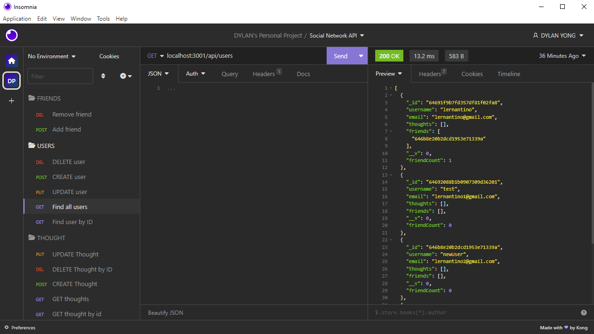
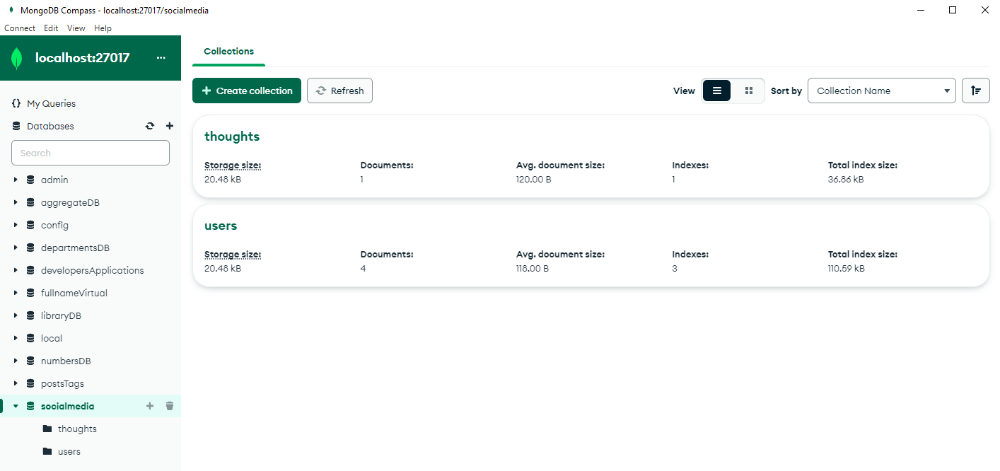

# Social-Network-API

## Description

This is an API for a social network web application that allows users to share their thoughts, react to friend's thoughts, and create a friend list. This API uses Express.js for routing, MongoDB database and Mongoose ODM. The seed data is created using Insomnia.

## Installation

- Clone the repository.
- On Visual Studio Code, install the dependencies by typing "npm install" in the terminal. This will install Express.js and Mongoose.
- Open MongoDB and connect to the MongoDB URI "mongodb://localhost:27017"
- To start the application, run "npm start"
- To create seed data and test the API routes, use Insomnia or Postman.

## Screenshots

## Video Demonstration

Here is a link to a video that demonstrates the functionality of the application.  
https://drive.google.com/file/d/1KVYmhUKtAteRSOPgMqKKCro4wZQsX5A_/viewLinks to an external site.

## Author

Dylan Yong, a student at UCF full-stack development bootcamp.  
Here is my github profile link:
[GitHub Profile](https://github.com/Suzakijun1)
